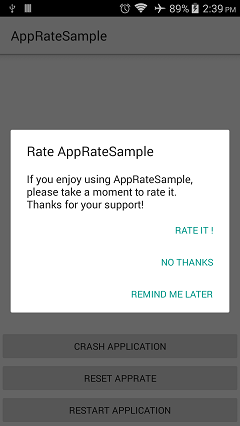
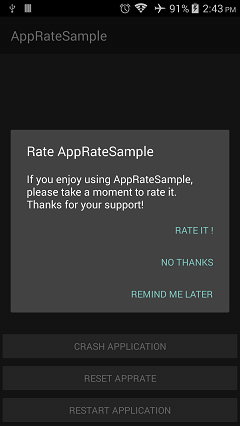

AppRate
=======

* AppRate allows your users to rate your application.

* AppRate shows a customizable rate dialog according to your chosen settings.

* This fork of the library uses AppCompat AlertDialog instead of the usual app.AlertDialog.

How to install and use
----------------------

1. Add the following code to your project build.gradle file.

	allprojects {
		repositories {
			...
			maven { url "https://jitpack.io" }
		}
	}

2. Add the following to your module build.gradle file.

	dependencies {
	        compile 'com.github.AdeelTariq:AppRate:2.0'
	}


3. Use AppRate as follows in your `MAIN` activity: 

```java
new AppRate(this).init();
```

Features
--------

* You can decide **not to prompt the user** if the application **has crashed once**.

```java
new AppRate(this)
	.setShowIfAppHasCrashed(false)
	.init();
```

* You can decide **when to prompt the user**.

```java
new AppRate(this)
	.setMinDaysUntilPrompt(7)
	.setMinLaunchesUntilPrompt(20)
	.init();
```

* You can **customize** all the messages and buttons of **the rate dialog**.

```java
AlertDialog.Builder builder = new AlertDialog.Builder(this)
	.setCustomTitle(myCustomTitleView)
	.setIcon(R.drawable.my_custom_icon)
	.setMessage("My custom message")
	.setPositiveButton("My custom positive button", null)
	.setNegativeButton("My custom negative button", null)
	.setNeutralButton("My custom neutral button", null);

new AppRate(this)
	.setCustomDialog(builder)
	.init();
```

* You can set **your own click listener**.

```java
new AppRate(this)
	.setOnClickListener(new DialogInterface.OnClickListener() {
		@Override
		public void onClick(DialogInterface dialog, int which) {
			// Do something.
		}
	})
	.init();
```

Screenshots
-----------




License
-------

This content is released under the MIT License.
